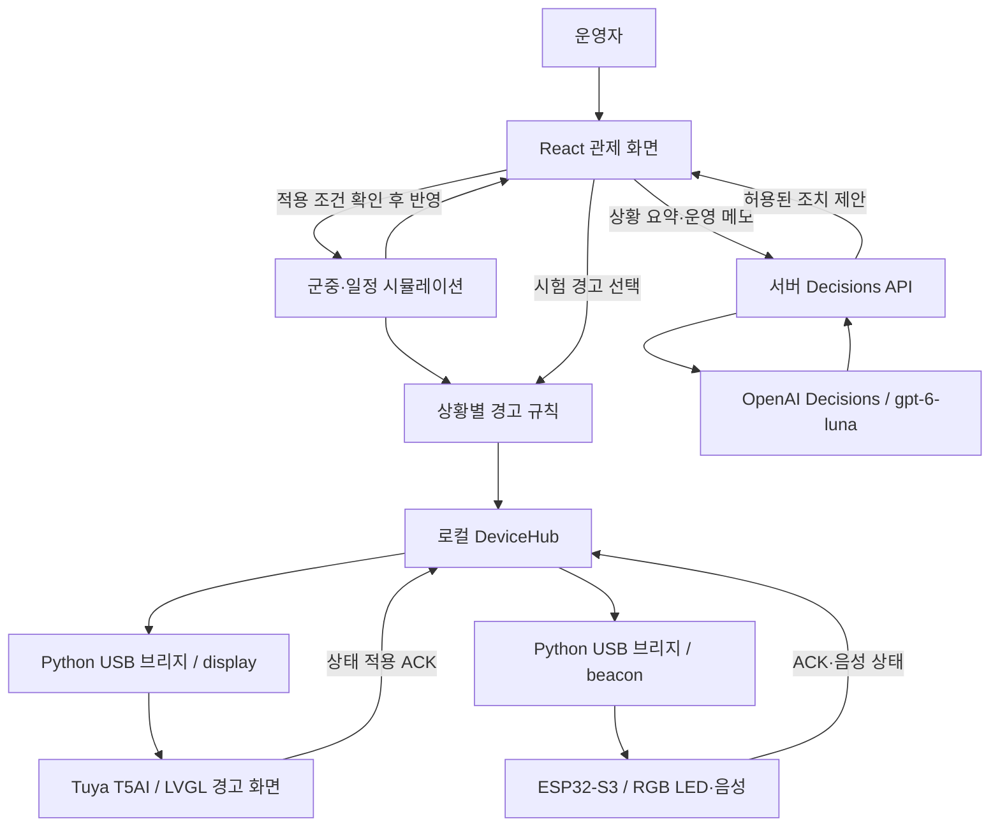
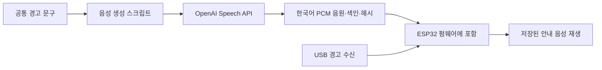
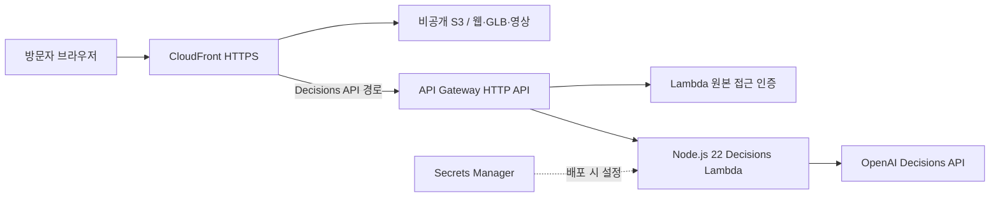
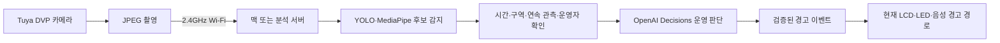

# JEONJO 기술 구성 및 OpenAI·Codex 활용 보고서

작성일: 2026년 10월 9일\
프로젝트: `Codex_DevDay` / 제품명: **JEONJO(전조)**\
작업 브랜치: `codex/device-alerts-camera`

이 문서는 지금까지 진행한 개발 작업과 저장소의 코드·설정을 바탕으로 작성했다. 웹 관제, 시뮬레이션, OpenAI 판단, USB 경고 장치, AWS 배포를 함께 설명하며, 이미 구현한 기능과 앞으로 연결할 기능을 구분한다. 라이브러리 버전은 작성 당시 lock 파일을 기준으로 한다. 진행 중인 미커밋 작업도 포함하므로 배포된 웹사이트와 로컬 작업본의 세부 화면은 다를 수 있다.

## 1. 프로젝트 개요

JEONJO는 행사장의 인원 이동과 운영 상황을 3D로 살펴보고, 여러 위험 시나리오에서 대응 방법을 비교하며, 필요한 안내를 화면·빛·음성으로 전달하는 행사 운영 지원 프로젝트다.

현재 시스템은 **합성 인물로 구성한 시뮬레이션과 사용자가 선택하는 시험 경고**를 입력으로 사용한다. 실제 행사장 녹화 영상도 볼 수 있지만, 영상에서 자동으로 위험을 감지해 장치에 전달하는 연결은 아직 구현하지 않았다.

| 구성 | 구현 내용 |
| --- | --- |
| 3D 행사장 관제 | 120명 인물, 18개 팀 테이블, 3개 출입구, 이동 경로·대기열·상태 표시 |
| 행사 일정 | 체크인부터 개발·식사·심사·시상·퇴장까지 시간표에 따른 행동 전환 |
| 운영 판단 | OpenAI Decisions API가 현재 상황에 맞는 운영 조치를 선택 |
| 다중 세계 실험 | 같은 조건에서 기존 대응과 개선 대응을 비교하고 취약점·악화 사례 확인 |
| 분석 대시보드 | 인원·밀도·활동·출입구·실험 결과를 차트와 원자료로 표시 |
| CCTV 화면 | 3D 가상 CCTV와 실제 행사장 녹화 영상 2개 재생 |
| Tuya 디스플레이 | 가로형 한국어 경고 화면, 원색 강조, 굵은 글씨, 픽토그램, 터치 확인 |
| ESP32 경고 장치 | 상황별 RGB LED 패턴과 한국어 음성 안내 |
| AWS 웹 배포 | CloudFront·S3·API Gateway·Lambda를 통한 공개 웹서비스 |
| 카메라 확장 | 장착 카메라의 촬영·전송·분석 연동 방안 검토, 제품 연결은 후속 작업 |

화면 브랜드는 JEONJO로 변경했다. 패키지명 `crowdguard-venue`, 일부 내부 식별자와 저장 형식에는 이전 이름인 CrowdGuard가 남아 있다.

## 2. 전체 시스템 구조

### 2.1 로컬 관제와 USB 장치



장치 경고는 시뮬레이션의 상태를 규칙으로 판정하거나 시험 버튼으로 발생시킨다. OpenAI는 행사 운영 조치를 선택하며, 현재 모델 응답을 그대로 USB 명령으로 실행하는 구조는 아니다. 운영 조치가 시뮬레이션의 흐름을 바꾸면 그 결과를 경고 규칙이 다시 판단한다.

디스플레이와 ESP32는 동일한 서버 상태 번호를 받아 각각 표시·점멸·음성을 수행한다. 여기서 동시 동작은 **같은 사건을 두 장치에 전달하는 방식**이며, 하드웨어 시계에 맞춘 정밀 동기화는 아니다. 브라우저 게시, 브리지 조회, 직렬 전송에 따른 짧은 시간 차이가 생길 수 있다.

### 2.2 OpenAI 음성 생성과 장치 재생



음성은 개발·준비 단계에서 생성해 보드 플래시에 넣는다. 경고가 발생할 때마다 OpenAI에 접속하지 않으므로, 생성 지연 없이 저장된 안내를 재생할 수 있다. 새로운 경고를 받으려면 관제 서버와 USB 연결은 계속 필요하다.

## 3. 소프트웨어 기술 스택

### 3.1 웹·시뮬레이션·분석

| 기술 | 적용 버전 | 역할 |
| --- | --- | --- |
| Node.js | 로컬 22.23.1, 프로젝트 안내 기준 22.12 이상 | 개발 서버·빌드·생성 스크립트 |
| TypeScript | 5.9.3 | 웹·서버·시뮬레이션의 타입 정의 |
| React / React DOM | 19.3.0 | 관제 화면과 패널 구성 |
| react-is | 19.3.0 | React 요소 판별 관련 의존성 |
| Vite | 8.3.4 | 개발 서버, 번들링, 서버 플러그인 |
| `@vitejs/plugin-react` | 6.1.2 | React 개발·빌드 통합 |
| Three.js | 0.180.0 | 3D 장면·모델·애니메이션·카메라 |
| `@react-three/fiber` | 9.8.1 | React와 Three.js 연결 |
| `@react-three/drei` | 10.7.9 | 카메라 제어 등 3D 보조 기능 |
| `@react-three/postprocessing` | 3.1.3 | React 장면의 후처리 연결 |
| postprocessing | 6.39.5 | Bloom·톤 매핑 등 화면 효과 |
| recast-navigation | 0.43.1 | WebAssembly 기반 경로 탐색·군중 이동 |
| XState | 5.33.2 | 인물 행동 상태 관리 |
| Zustand | 5.0.15 | 관제·AI 판단·장치·실험 상태 관리 |
| Recharts | 3.10.1 | 통계·비교 차트 |
| lucide-react | 0.468.0 | 웹 인터페이스 아이콘 |
| `@gltf-transform/core`, `extensions`, `functions` | 각각 4.5.1 | GLB 자산 생성·처리 |
| meshoptimizer | 1.3.0 | 3D 자산 최적화 도구 |
| Vitest | 5.0.3 | 기존 단위·통합 테스트 구성 |

타입 패키지는 `@types/node` 22.20.5, `@types/react` 19.3.0, `@types/react-dom` 19.3.0, `@types/three` 0.180.0이다. 선언 범위와 실제 설치 버전은 다를 수 있다. 예를 들어 React는 `^19.1.1`로 선언되어 있지만 현재 lock 파일은 19.3.0을 가리킨다.

TypeScript는 ES2022 대상, ESNext 모듈, Bundler 모듈 해석, `strict`, 미사용 변수·매개변수 검사, JSON 모듈 가져오기를 사용한다. 웹 글꼴은 로컬 Pretendard를 사용한다.

근거: [패키지 설정](../package.json), [버전 고정 파일](../package-lock.json), [TypeScript 설정](../tsconfig.json), [Vite 설정](../vite.config.ts).

### 3.2 장치·자산·인프라 도구

| 기술 | 버전·구성 | 역할 |
| --- | --- | --- |
| Python / pyserial | Python 3.12 사용 경로, pyserial 3.5 | USB 장치 탐색과 직렬 통신 |
| C / C++ | Tuya C, ESP32 Arduino C++ | 장치 펌웨어 |
| TuyaOpen | 커밋 `61e6c645be2cd7cb27d623a7f6a189f5b0f3fca3` 고정 | T5AI 보드 지원·빌드 |
| LVGL | 9 계열 | Tuya LCD 위젯·글꼴·터치·화면 회전 |
| Arm GNU Toolchain | 13.3.Rel1 사용 | Tuya 펌웨어 컴파일 |
| PlatformIO | `espressif32@6.9.0` | ESP32 빌드·업로드 |
| Arduino ESP32 | 2.0.17 | ESP32 실행 환경 |
| Adafruit NeoPixel | 1.12.3 | RGB LED 제어 |
| ES8311 드라이버 | Waveshare 예제 기반, Apache-2.0 라이선스 보존 | 스피커 코덱 제어 |
| fontTools | `fonttools[woff]==4.60.1` | Pretendard 가변 글꼴에서 실제 굵기 추출 |
| lv_font_conv | 1.5.3 | 한국어 글꼴을 LVGL C 자산으로 변환 |
| FFmpeg | H.264·AAC 변환 스크립트 사용 | 현장 녹화 영상의 웹 재생본·포스터 생성 |
| esbuild / yaml | 0.28.2 / 2.9.1 | Lambda 번들·인프라 설정 처리 |
| CloudFormation 검사 도구 | cfn-lint 1.57.2, cfn-guard 3.2.1 | 기존 AWS 템플릿 검사 구성 |
| C 검사 도구 | Clang, AddressSanitizer, UndefinedBehaviorSanitizer | 기존 프로토콜·LED 로직 검사 구성 |

근거: [Tuya 빌드 스크립트](../device/build-firmware.sh), [ESP32 설정](../device/esp32/platformio.ini), [글꼴·카탈로그 생성](../device/generate-assets.mjs), [인프라 패키지](../infra/package.json).

## 4. 3D 행사장과 인물 시뮬레이션

### 4.1 공간과 인원

| 항목 | 구성 |
| --- | --- |
| 행사장 크기 | 가로 29m × 세로 14m × 높이 3.45m의 가정 공간 |
| 팀 테이블 | 3행 × 6열, 총 18개 |
| 참가자 좌석 | 테이블당 6석, 총 108석 |
| 전체 인물 | 참가자 108명, 운영요원 3명, 응급구조사 2명, 심사위원 6명, 발표자 1명 |
| 출입구 | A 서측, B 중앙, C 동측 |
| 출입구 처리량 가정 | A 0.8명/초, B 1.1명/초, C 1.4명/초 |
| 역할 구분색 | 참가자 파랑, 운영요원 주황, 응급구조사 초록, 심사위원 노랑, 발표자 보라 |

공간 크기와 처리량은 시뮬레이션용 설정값이다. 현장 측량이나 실제 출입구의 공인 처리 능력을 뜻하지 않는다. 인물의 이름·직무·팀·보행 속도·반응 시간·이동 지원 필요·알레르기 정보도 합성 페르소나이며 실제 참석자의 신상이나 건강 정보를 추정한 것이 아니다.

근거: [공간 구성](../src/simulation/layout.ts), [페르소나 생성](../src/simulation/profiles.ts), [역할 색상](../src/simulation/role-palette.json).

### 4.2 이동·행동·렌더링

- Recast가 이동 가능한 공간을 생성하고 Detour Crowd가 인물 이동과 주변 회피를 처리한다. 출입구를 닫으면 동적 장애물을 반영해 경로를 다시 계산한다.
- 길찾기 셀 크기·높이는 각각 0.1, 타일 크기는 32이며, 군중 엔진은 최대 160명·최대 반경 0.35m로 설정했다. 동적 장애물 한도는 16개다.
- 군중 계산은 0.05초 간격으로 진행하고, 렌더링 프레임 사이에서는 위치를 보간한다. 관제 스냅샷은 시뮬레이션 시간 기준 약 0.2초 간격으로 갱신한다.
- 행동 상태는 작업·이동·대기·안내·발표·식사·네트워킹·심사·단체사진·퇴장 등으로 나눈다. 운영요원과 응급구조사는 현장 지원 동선을 공유하면서 업무 표시를 다르게 한다.
- 카메라는 전체 보기, 위에서 보기, 실내 시점, 선택 인물 따라가기를 제공한다. 경로·밀도·벽·주야간·화면 품질을 조절할 수 있다.
- GLB 인물 자산은 코드로 생성했다. 현재 외형 7종, 역할 5종, 뼈대 11개, 애니메이션 8개를 사용한다. 애니메이션은 `Idle`, `Walk`, `Seated`, `Listen`, `Eat`, `Applaud`, `Guide`, `Talk`다.
- 정적 형상 병합, 반복 형상 인스턴싱, 환경 조명, 후처리, 화면 해상도 비율 조절을 사용한다. 초기 DPR 상한은 1.5이며 균형 품질은 1을 사용한다.
- 인물 상세 화면에서 현재 상태·목적지·속도·이동 거리·대기 순서·행동 이력을 확인한다. 관찰 등록과 400자 이내 메모는 Zustand persist를 통해 해당 브라우저에 저장한다.

근거: [이동 엔진](../src/simulation/navigation.ts), [군중 월드](../src/simulation/world.ts), [3D 장면](../src/scene/Scene.tsx), [인물 패널](../src/people/PeoplePanel.tsx), [GLB 생성](../scripts/generate-assets.mjs).

### 4.3 행사 일정

09:00 체크인부터 21:00 종료까지 11개 주요 단계를 구성했다. 오전·오후 개발, 점심, 17:00 제출 마감, 17:10 트랙 심사, 18:30 결선 진출팀 발표, 18:40 결선, 20:30 시상으로 이어진다. 마지막 구간은 시상·단체사진·20:50 이후 퇴장으로 세분화한다.

자동 재생에서는 행사 시간 1분을 시뮬레이션 1초로 압축한다. 단계별로 좌석 이동, 발표 청취, 배식, 심사, 제출 점검 등 인물의 목적과 행동을 바꾼다. 별도로 약 85초의 출입구 통제·안내 시연 흐름도 제공한다.

근거: [일정 및 허용 조치](../src/simulation/agenda.ts), [일정 화면](../src/AgendaPanel.tsx).

## 5. 다중 세계 실험과 분석

### 5.1 실험 엔진

다중 세계 실험은 메인 화면의 Recast 군중 엔진과 별도로 구현한 **사건·경로·대기열 계산 모형**이다. 모델 식별자는 `venue-event-queue/1.1`이다. 1.1에서는 현장 인력의 시작 위치를 메인 장면과 통일해 재생 시 캐릭터가 겹치던 문제를 수정했다. 같은 무작위 조건에서 대응 전후를 한 쌍으로 계산해 비교의 기준을 맞춘다.

| 항목 | 구성 |
| --- | --- |
| 시나리오 | 화재 구역, 정전·출구 통제, 보안 위협 의심, 점심·알레르기 |
| 실험 수 | 화면에서 100 / 1,000 / 5,000 / 10,000개 세계 선택 |
| 실제 비교 단위 | 세계마다 대응 전·후 2회 계산, 10,000개 세계는 총 20,000회 계산 |
| 기본 설정 | 시드 20261009, 1,000개 세계, 혼합 시나리오, 관찰 180초 |
| 입력 범위 | 32bit 부호 없는 시드, 1~10,000개 세계, 관찰 시간 60~600초 |
| 병렬 처리 | 브라우저 Web Worker 1~4개, CPU 논리 코어 수를 참고해 결정 |
| 이동·대기 | 테이블을 피하는 경로망, 출입구 선입선출 대기열, 지원 인력 배정 |
| 취소·오류 처리 | 완전히 수신한 비교 쌍만 보존, 결과 중복·누락 확인 |
| 재생 | 같은 세계의 전후 비교, 시간 이동, 1·4·16배속, 인물 선택 |
| 저장 | `crowdguard-experiment/1` 형식의 JSON 내보내기 |

비교하는 대응 규칙은 출입구 분산, 위험 구역 경로 제외, 화면·음성 복수 채널 안내, 이동 지원 담당 배정, 보안 위협 확인 절차, 배식 전 알레르기 확인의 6개다. 기본 비교안은 규칙 전체 비활성/활성으로 구성한 시연용 설정이며 실제 행사 매뉴얼을 자동 분석해 만든 결과는 아니다.

측정 항목은 대응 미완료, 위험 구역 통과, 이동 지원 미배정, 부적합 식재료 노출, 첫 대응 지연, 보안 절차 공백, 출구 최대 대기열이다. 완료 시간과 출구별 배정 인원도 계산한다. 60초 반응·12명 대기 기준과 취약점 점수는 모형 내부의 관찰 기준이며, 법적 안전 기준이나 실제 사고 확률은 아니다.

개선 후 값이 나빠진 세계도 별도로 집계한다. 실험을 끝내고 현재 설정이 결과와 일치할 때만 매뉴얼을 승인할 수 있으며, 승인 범위는 `simulation-only`다. 설정을 바꾸면 기존 승인은 무효가 된다.

근거: [모형과 지표](../src/lab/model.ts), [계산 엔진](../src/lab/engine.ts), [Worker](../src/lab/worker.ts), [실험 상태](../src/lab/store.ts), [JSON 보고서](../src/lab/report.ts).

### 5.2 감지 후보 처리 화면

화재·위험 물체 후보는 시연 입력 또는 외부 JSON으로 넣을 수 있다. 후보 확인 → 확정 또는 기각 → 대응 전달 → 수신 확인의 흐름을 표현한다. 검토한 매뉴얼과 승인 상태도 확인한다.

이 기능의 대응 전달은 현재 **모의 작업과 기록 생성**이다. 실제 YOLO·MediaPipe 추론, 현장 담당자 메시지 발송, 출입문 제어, USB 경고 장치와의 자동 연결은 포함하지 않는다. 실험 후보의 구역 값 `0~2`와 USB 장치의 전체/A/B/C 구역 값 `0~3`도 서로 다른 계약이다.

근거: [감지 후보 계약](../src/lab/detection.ts), [감지 화면](../src/lab/DetectionPanel.tsx).

### 5.3 분석 대시보드

Recharts로 현재 활동 분포, 시간에 따른 인원 변화, 출입구 배정·대기·퇴장, 대응 전후 취약점, 악화 세계, 대기열 분포를 표시한다. 차트 애니메이션 전환과 모션 감소 설정을 고려했다.

밀도는 행사장을 기본 2m × 2m 격자로 나누어 계산하며, 가장자리의 좁은 셀은 실제 셀 면적을 적용한다. 미입장·퇴장·공간 밖 인물은 제외하고 가구 면적은 별도로 빼지 않는다. 시간 추이는 시뮬레이션 시간 기준 최근 90초를 사용한다. 출입구 대기 인원은 배정 인원의 부분집합이므로 두 값을 중복 합산하지 않는다.

실험 차트는 시나리오 필터와 원자료 표를 제공한다. 화재·정전의 출구 대기열은 15명 단위 구간으로 집계한다. 모든 수치는 해당 시뮬레이션의 결과이며 실제 CCTV에서 계수한 인원은 아니다.

근거: [분석 화면](../src/analytics/AnalyticsDashboard.tsx), [집계](../src/analytics/data.ts), [시간 이력](../src/analytics/telemetry.ts).

## 6. CCTV·미디어 구성

| 항목 | 구현 |
| --- | --- |
| 가상 CCTV | 3D 장면을 별도 카메라와 렌더 타깃으로 촬영한 화면 |
| 가상 화면 크기 | 기본 384×216, 확대 시 768×432 |
| 가상 화면 갱신 | 시뮬레이션 시간 약 0.18초 간격을 기준으로 갱신 |
| 실제 CAM1·CAM2 | 행사장 녹화 MP4 2개, 스크린 방향·출입구 방향 |
| 웹 영상 형식 | 가로 1280 기준 비율 유지, H.264, yuv420p, AAC 80kbps, MP4 faststart |
| 변환 옵션 | libx264, preset fast, CRF 25, 메타데이터 제거 |
| 재생 전 이미지 | 영상 1초 지점, 가로 640 기준 JPEG |
| 조작 | 재생·정지·처음으로·위치 이동·음소거·확대·전체 화면 |
| 상태 유지 | 화면을 오가는 동안 재생 위치·선택 영상 유지, 숨겨진 화면에서는 일시정지 |

현재의 실제 CAM 화면은 **녹화 영상 반복 재생**이다. 실시간 IP 카메라 스트림이나 Tuya 장착 카메라 영상은 아니다. 전체 화면 관람 모드에서는 관제 패널을 숨겨 3D 장면을 크게 볼 수 있다.

근거: [CCTV 플레이어](../src/cctv/CctvMonitor.tsx), [영상 변환](../scripts/prepare-cctv.mjs).

## 7. OpenAI 활용 방식

### 7.1 사용 지점과 모델

| 사용 지점 | API·모델 | 입력 | 결과·적용 시점 |
| --- | --- | --- | --- |
| 행사 운영 판단 | `/v1/decisions`, `gpt-6-luna` | 행사 단계, 인원 수, 출입구, 안내 상태, 운영 메모 | 실행 중 허용된 운영 조치 1개 선택 |
| 실험 결과 검토 | `/v1/decisions`, `gpt-6-luna` | 완료 세계 수, 시드, 취약점·개선·악화 집계 | 우선 검토할 매뉴얼 조항 또는 추가 조사 선택 |
| 한국어 음성 생성 | `/v1/audio/speech`, `gpt-4o-mini-tts-2025-12-15` | 고정 안내 문구와 발화 지시 | 개발·준비 시 PCM 음원 생성, ESP32에 저장 |

프로젝트는 Typesafe.ai 대신 OpenAI Decisions API를 사용한다. 현재 실행 코드에서 확인되는 외부 OpenAI 호출은 위의 Decisions와 Speech 경로다. Node.js의 기본 `fetch`로 요청하며 OpenAI SDK를 앱 의존성으로 추가하지 않았다.

작성일 기준 OpenAI 공식 문서는 Decisions를 공개 베타로 안내하며 `gpt-6-luna`와 전용 `/v1/decisions` 경로를 명시한다. API가 제공하는 판정 형식 중 이 프로젝트는 **`choice` 형식**을 사용한다. [OpenAI Decisions 문서](https://developers.openai.com/api/docs/guides/decisions)

### 7.2 운영 판단 계약

브라우저는 `POST /api/decisions/evaluate`로 현재 행사 단계·시각, 실내/이동/대기/막힘/예정 인원, 안내 인력 배치 여부, A/B/C 출입구 상태, 최대 400자의 운영 메모를 보낸다. 서버는 입력을 검증하고 현재 단계에서 허용되는 조치 목록을 덧붙여 OpenAI에 전달한다.

| 조치 | 의미 | 허용 시점 |
| --- | --- | --- |
| `observe` | 현재 운영 유지 | 전체 |
| `dispatch_guides` | 현장 지원 인력 배치 | 전체 |
| `stagger_meals` | 식사 인원 순차 이동 | 점심·트랙 심사 |
| `focus_session` | 발표 청취 안내 | 안내·AWS 세션·발표·결선 관련 단계 |
| `submission_help` | 제출·발표 준비 점검 | 제출 점검 단계 |
| `guide_departure` | 퇴장 동선 안내 | 마지막 단계의 20:50 이후 |

프롬프트에는 합성 시뮬레이션이라는 출처, 허용 조치만 선택할 것, 평상시 이동만으로 위험을 추정하지 않을 것, 실제 문을 열고 닫거나 시간표를 바꾸지 않을 것을 명시했다. 운영 메모도 API 동작을 바꾸는 지시가 아닌 상황 정보로 다룬다.

응답에서는 질문 이름, 조치 종류, 신뢰도, 선택지별 확률, 사용량을 검사한다. 신뢰도·확률은 0~1 범위이며 확률의 중복·누락과 합계 오차 0.015 초과를 거부한다. 반환 정보에는 실제 모델명, 조치, 신뢰도, 확률 분포, 요청 소요 시간, 토큰 사용량이 포함된다.

조치 적용에는 신뢰도 0.65 이상이 필요하다. 자동 판단을 켜도 이 조건을 통과해야 하며, 요청 당시 월드·운영 설정이 바뀌거나 시뮬레이션 기준 45초가 지나면 결과를 적용하지 않는다. 모델 거절·오류·오래된 응답을 임의의 성공 결과로 대체하지 않는다.

근거: [요청·응답 계약](../src/decision/contract.ts), [판단·적용 상태](../src/decision/store.ts), [운영 판단 상세 문서](decisions.md).

### 7.3 실험 결과 검토

`POST /api/decisions/review`는 최대 7개 취약점 집계와 전후 비교·악화 사례를 전달한다. OpenAI는 대응 규칙 6개 중 먼저 검토할 항목 또는 `investigate`를 선택한다. 서버는 선택지·신뢰도·확률 분포를 검증하고 검토 항목·신뢰도·모델명·소요 시간을 반환한다.

수천 개 세계의 인물 행동을 매번 LLM으로 생성하지 않는다. 실험은 브라우저 계산 엔진이 수행하고, OpenAI는 계산된 근거를 바탕으로 **검토 우선순위**를 제안한다. 이 결과는 실제 현장 대응의 자동 승인이나 안전 인증으로 사용하지 않는다.

근거: [매뉴얼 검토 계약](../src/lab/review.ts), [공통 서버](../server/decisions.ts).

### 7.4 한국어 음성 생성

`marin` 목소리에 차분하고 또렷한 한국어 여성 안내 방송, 보통 속도, 정확한 문구 낭독, 음악·효과음·추가 설명 제외를 지시했다. 시험·시뮬레이션 출처와 AI 합성 음성임을 알리는 문구도 포함한다.

| 항목 | 구성 |
| --- | --- |
| 음원 수 | 18개: 상황 9개, 구역 4개, 시험·시뮬레이션·연결 끊김·준비·복수 경고 5개 |
| PCM 형식 | 24kHz, signed 16bit little-endian, 모노 |
| 저장된 결합 음원 | 4,243,200바이트, 약 4.05MiB, 총 88.4초 |
| 생성 캐시 | 문구·모델·목소리·지시를 포함한 요청의 SHA-256으로 구분 |
| 출력 산출물 | `voice.pcm`, `voice_index.h`, `voice-manifest.json` |
| 음량 처리 | 피크가 최대 진폭의 80%를 넘으면 낮춤, 작은 음원을 증폭하지 않음 |
| 자산 보호 | 음원별 길이·위치·해시 및 현재 문구와 일치 여부 확인 |
| 실행 방식 | 펌웨어 내장 음원 재생, 경고 발생 때 API 호출 없음 |

OpenAI의 PCM 출력 형식과 한국어 지원은 공식 음성 문서를 기준으로 사용했다. [OpenAI Text to speech 문서](https://developers.openai.com/api/docs/guides/text-to-speech)

근거: [음성 생성 스크립트](../device/generate-voices.mjs), [음성 자산 검사](../device/esp32/check_assets.py), [ESP32 펌웨어](../device/esp32/src/main.cpp).

### 7.5 키와 요청 관리

로컬에서는 `.env.local`의 `OPENAI_API_KEY`를 서버와 음성 생성 스크립트만 읽는다. `VITE_` 접두어로 브라우저에 노출하지 않으며 장치 펌웨어에도 키를 넣지 않는다. AWS에서는 Secrets Manager의 값을 배포 시 Lambda 환경 변수로 주입한다.

서버는 JSON 요청, 8KiB 본문 상한, 요청 출처 확인, 15초 외부 요청 제한 시간, 요청 간 2.5초 간격과 실행 중 중복 요청 제한을 둔다. 브라우저 판단 요청 제한 시간은 18초다. 키 미설정·요청 초과·입력 오류·모델 거절·외부 호출 실패를 구분해 알린다.

`GET /api/decisions/status`는 키 설정 여부와 모델 이름만 반환한다. 이 응답 자체가 외부 OpenAI 호출 성공을 의미하지는 않는다. 또한 Lambda의 메모리 내 요청 제한은 실행 환경별로 적용되므로 전체 사용자에 대한 통합 사용량 제한과는 다르다.

근거: [서버 미들웨어](../server/decisions.ts), [환경 변수 예시](../.env.example), [AWS 어댑터](../infra/lambda/handler.ts).

## 8. Tuya 디스플레이 장치

### 8.1 하드웨어와 사용 범위

| 항목 | 사양·구성 |
| --- | --- |
| 보드 | Tuya T5AI-Board V1.0.2 + 3.5인치 35565 LCD 모듈 |
| 메인 칩·모듈 | T5QN88 / T5-E1-IPEX |
| CPU | Armv8-M M33F, 최대 480MHz |
| 메모리 | Flash 8MB, PSRAM 16MB, 공유 SRAM 640KB |
| LCD | ILI9488, RGB565, 패널 기본 320×480 |
| 터치 | GT1151 계열 정전식 터치 |
| 현재 화면 | LVGL 90도 회전, **480×320 가로 화면** |
| USB | WCH 계열 `USB Dual_Serial`, VID `0x1A86` |
| 직렬 역할 | 다운로드·CLI 포트와 디버그 로그 포트 분리 |
| 무선 지원 | 2.4GHz Wi-Fi 4/6, 802.11 b/g/n/ax, BLE 5.4 |
| 주변장치 지원 | 마이크 2채널, 스피커 1채널, microSD, DVP 카메라, GPIO 및 직렬 버스 |
| 카메라 지원 | 공식 보드 문서·드라이버의 GC2145 2MP DVP 구성 |

CPU·메모리·무선은 [T5-E1-IPEX 데이터시트](https://developer.tuya.com/en/docs/iot/T5-E1-IPEX-Module-Datasheet?id=Kdskxvxe835tq), LCD·터치·카메라 구성은 [Tuya T5AI-Board 문서](https://docs.tuyaopen.ai/docs/hardware/tuya-t5/t5-ai-board/overview-t5-ai-board)를 참고했다. 사용자가 카메라 장착을 알려 주었으나 현재 펌웨어에서 센서 식별·촬영·스트리밍을 수행하는 상태는 아니다.

현재 JEONJO 전용 설정은 T5AI 보드, 35565 LCD, 직렬 CLI, LVGL, 터치를 활성화한다. 이전 TClaw 프로그램의 Wi-Fi·Bluetooth·AEC·Opus·음성 대화 기능이 모두 현재 펌웨어에서도 실행된다고 해석하면 안 된다. 이번 구성에서는 Tuya가 경고 화면을, ESP32가 LED와 음성을 담당한다.

근거: [현재 펌웨어 설정](../device/firmware/app_default.config), [Tuya 장치 안내](../device/README.md).

### 8.2 화면 디자인

| 요소 | 구현 내용 |
| --- | --- |
| 이름 | 상단 `JEONJO` |
| 배경·본문 | 검정 `#000000`, 흰색 `#FFFFFF` |
| 위험 | 빨강 `#FF0000` |
| 주의 | 노랑 `#FFFF00` |
| 수신된 경고 없음 | 초록 `#00FF00` |
| 연결 대기·통신 상태 | 하늘색 `#00CFFF` |
| 글꼴 | Pretendard 400·800, 본문 20px, 제목 28px, 4bpp LVGL 자산 |
| 강조 | 제목·위치·주요 행동 문구·확인 버튼에 Extra Bold 적용 |
| 픽토그램 | 오른쪽 위 56×56, 상황별 공통 도형 데이터 사용 |
| 배치 | 상단 출처·연결, 중앙 제목·위치·행동, 하단 경고 수·확인 버튼 |
| 안내 문구 | 최대 두 줄로 명시해 굵기가 바뀌는 구간에서도 배치 유지 |
| 터치 확인 | 읽었음을 표시하며 위험 상황 자체를 해제하지 않음 |

웹 미리보기와 실제 펌웨어가 같은 경고 카탈로그와 픽토그램 데이터를 사용한다. Pretendard에서 실제 800 굵기를 추출했으며, 펌웨어에서는 벡터 도형과 한국어 글꼴 자산을 직접 렌더링한다.

화면 회전은 LVGL에서 적용해 표시 좌표와 터치 좌표를 함께 바꾼다. 연결이 끊겼을 때는 마지막 경고를 유지하고 연결 상태를 별도로 표시한다. 초록 화면의 의미는 수신된 경고가 없다는 것이며, 실제 현장 전체의 안전을 판정한 결과는 아니다.

근거: [경고 카탈로그](../device/alerts.json), [픽토그램](../device/pictograms.json), [LCD 구현](../device/firmware/src/tuya_app_main.c), [웹 미리보기](../src/device/DevicePanel.tsx).

## 9. ESP32 LED·음성 장치

### 9.1 하드웨어와 핀

| 항목 | 사양·구성 |
| --- | --- |
| 제품 | Waveshare ESP32-S3-AUDIO-Board |
| 프로세서 | ESP32-S3, Xtensa LX7 듀얼 코어, 최대 240MHz |
| 메모리 | Flash 16MB, PSRAM 8MB, 칩 SRAM 512KB |
| LED | 링 형태 RGB 7개, GPIO38, RGB 순서 |
| 스피커 | ES8311 코덱·앰프·스피커 |
| 마이크 | ES7210 및 마이크 2개, 현재 경고 펌웨어에서는 미사용 |
| I²C | SDA GPIO11, SCL GPIO10 |
| I²S 출력 | MCLK12, BCLK13, LRCK14, DOUT16 |
| I/O 확장 | TCA9555 주소 `0x20`, 앰프 EXIO8 |
| 사용자 버튼 | KEY1/2/3 = EXIO9/10/11, active-low |
| USB | Native USB CDC, VID/PID `303a:1001` |
| 기타 지원 | 2.4GHz Wi-Fi, BLE 5 LE, PCF85063 RTC, TF, DVP·LCD 확장, 3.7V 배터리 충전 |

보드 사양은 [Waveshare 제품 문서](https://docs.waveshare.com/ESP32-S3-AUDIO-Board), 핀 구성은 [공식 회로도](https://files.waveshare.com/wiki/ESP32-S3-AUDIO-Board/ESP32-S3-AUDIO-Board_1.1.pdf)와 프로젝트 펌웨어를 기준으로 했다. 마이크·RTC·TF·무선·카메라는 이번 경고 펌웨어에서 활성화하지 않았다.

### 9.2 경고별 표시와 음성

| ID | 상황 | 우선순위 | 화면·LED 색 | LED 패턴 | 음성 반복 |
| --- | --- | --- | --- | --- | --- |
| 0 | 수신된 경고 없음 | 0 | 초록 | 천천히 밝아졌다 어두워짐 | 변경 시 한 번 |
| 1 | 출입구 통제 | 20 | 노랑 | 점멸 | 60초 |
| 2 | 이동 정체 | 30 | 노랑 | 천천히 밝아졌다 어두워짐 | 60초 |
| 3 | 경로 막힘 | 40 | 노랑 | 회전 | 60초 |
| 4 | 모든 출입구 통제 | 70 | 빨강 | 전체 점멸 | 30초 |
| 5 | 낙상 의심 | 60 | 빨강 | 두 번 점멸 | 30초 |
| 6 | 응급 도움 요청 | 65 | 빨강 | 맥박 모양 | 30초 |
| 7 | 화재 의심 | 90 | 빨강 | 1초 주기 점멸 | 30초 |
| 8 | 위험 물체 의심 | 80 | 빨강 | 좌우 교차 | 30초 |

연결 대기는 하늘색 회전으로 표시한다. 활성 경고 중 연결이 끊기면 경고 색과 하늘색 연결 표시를 함께 유지하고 연결 끊김을 한 번 안내한다. A/B/C 위치는 LED 구간과 음성으로 구분하지만 LED 링 방향이 실제 출입구 방향과 일치한다고 가정하지 않는다.

LED·직렬 통신과 오디오 재생은 별도 작업으로 처리한다. 오디오 버퍼에는 PSRAM을 사용하고 PCM 모노 샘플을 I²S 출력 채널에 전달한다. 같은 경고의 주기적 수신은 음성을 재시작하지 않으며, 경고 종류·구역·출처가 바뀌면 기존 음성을 중단하고 새 안내를 시작한다.

KEY1은 음량 +5, KEY3은 -5, KEY2 짧게 누르기는 현재 안내 음소거·해제, 1초 누르기는 다시 듣기다. 기본 음량은 65, 범위는 10~75이며 이는 코덱 설정값이다. 음소거해도 LED는 계속 동작하고 새로운 경고는 다시 음성으로 안내한다.

현재 빌드 산출물은 4,554,608바이트이며 음원을 포함한다. 파티션은 8MiB 앱 영역과 별도 저장 영역을 확보했고, 현재 음원은 파일시스템 대신 앱에 내장한다. 전원 차단 후 마지막 경고를 영구 복원하는 기능은 구현하지 않았다.

근거: [ESP32 안내](../device/esp32/README.md), [펌웨어](../device/esp32/src/main.cpp), [LED·경고 로직](../device/esp32/include/beacon_logic.h), [파티션](../device/esp32/partitions.csv).

## 10. 장치 통신과 경고 규칙

### 10.1 로컬 API와 직렬 계약

| 항목 | 구성 |
| --- | --- |
| 브라우저 → 서버 | 약 1초 간격으로 상태 게시 |
| 상태 게시 | `POST /api/device/publish` |
| 브리지 상태 조회 | `GET /api/device/state`, 기본 약 0.5초 간격 |
| 적용 응답 게시 | `POST /api/device/ack` |
| 직렬 통신 | 두 장치 모두 115200 baud |
| 패킷 | `cg_alert 1,epoch,revision,kind,zone,source,count,fresh` |
| 적용 ACK | `CG_ACK 1,epoch,revision` |
| Tuya 상태 | `cg_status`, 경고·연결·가로 해상도·회전·강조·픽토그램 정보 |
| ESP32 상태 | `jg_status`, 오디오 초기화·음소거·재생·음량·완료 횟수 |
| 구역 | 전체=0, A=1, B=2, C=3 |
| 출처 | 시뮬레이션=0, 시험=1 |
| 경고 개수 | 요청당 최대 32개, 중복 정리 후 우선순위 선택 |
| 끊김 판단 | 발행 상태 8초, 장치 ACK 유효 시간 5초 |

서버 시작마다 `epoch`를 만들고, 장치 표시 상태가 바뀔 때 `revision`을 증가시킨다. 브리지는 해당 상태에 맞는 ACK만 인정한다. 여러 관제 창이 동시에 충돌하지 않도록 하나의 발행자를 일정 시간 유지하며, 이전 순서의 요청과 같은 상태 번호에 다른 내용을 넣은 패킷은 거부한다.

USB에는 검증된 숫자만 보내고 한국어 문구는 보드의 카탈로그에서 선택한다. 장치 API는 localhost와 같은 출처를 확인한다. HTTP 요청 오류만으로 ESP32 직렬 포트를 다시 열지 않도록 구성해 불필요한 보드 재부팅과 음성 중단을 줄였다.

개발 시 연결 경로는 Tuya `/dev/cu.usbmodem5AAE1657771`, Tuya 디버그 `/dev/cu.usbmodem5AAE1657773`, ESP32 `/dev/cu.usbmodem1101`이었다. macOS의 포트 이름은 재연결에 따라 달라질 수 있어 브리지의 자동 탐색 또는 명시적 포트 옵션을 사용한다.

근거: [DeviceHub](../server/device.ts), [브리지](../device/bridge.py), [공통 C 프로토콜](../device/firmware/src/cg_protocol.c), [브라우저 장치 상태](../src/device/store.ts).

### 10.2 자동 발생 조건

| 경고 | 현재 입력·조건 |
| --- | --- |
| 출입구 통제 | 시뮬레이션 출입구가 닫힘 |
| 모든 출입구 통제 | 실내 인원이 있고 세 출입구가 모두 닫힘 |
| 이동 정체 | 대기 13명 이상이 5초 유지되면 발생, 8명 이하가 5초 유지되면 해제 |
| 경로 막힘 | 막힌 인물이 3초 이상 유지되고 모든 출입구 통제 상태가 아닐 때 |
| 낙상·응급·화재·위험 물체 | 현재는 운영 화면에서 선택하는 시험 경고 |

발생 기준과 해제 기준을 다르게 둬 경계 근처에서 경고가 반복해서 켜졌다 꺼지는 현상을 줄였다. 경고가 여러 개면 가장 높은 우선순위의 내용을 표시하고 전체 경고 수를 함께 안내한다.

장치의 ACK는 펌웨어가 상태를 적용했다는 의미이고, 음성 완료 횟수는 I²S 전송 완료를 나타낸다. 이 값으로 사람이 실제 화면을 읽었거나 안내를 들었다고 판단하지 않는다.

근거: [경고 규칙과 정렬](../src/device/alerts.ts).

## 11. AWS 배포 구성

공개 웹 주소는 [JEONJO 웹사이트](https://dwif7iiddu9dy.cloudfront.net)다. 프로젝트·CLI 프로필은 `ppippoppippo`, 리전별 리소스의 선택된 리전은 시드니 `ap-southeast-2`다. CloudFront는 글로벌 서비스로 사용한다.



| 영역 | 구현 |
| --- | --- |
| 정적 웹 | 비공개 S3, 버전 관리·암호화·공개 접근 차단, CloudFront OAC |
| CDN | HTTPS, HTTP/2·3, 압축, 정적 자산 캐시 |
| SPA 경로 | CloudFront Function `cloudfront-js-2.0` |
| API | API Gateway HTTP API, `/api/decisions/*`, 응답 캐시 비활성 |
| 판단 Lambda | Node.js 22, arm64, 메모리 256MB, 제한 시간 20초 |
| 원본 인증 Lambda | Node.js 22, arm64, 메모리 128MB, 제한 시간 5초 |
| 원본 접근 제어 | CloudFront가 추가한 비밀 헤더를 인증기와 판단 함수에서 확인 |
| 요청 제한 | API Gateway rate 2회/초, burst 5 설정 |
| 키 저장 | Secrets Manager → CloudFormation 참조 → Lambda 환경 변수 |
| 로그 | CloudWatch Logs, 보존 14일 |
| 경보 | 5분 동안 API 5xx 3건 기준 CloudWatch 경보, 외부 알림 수신처는 별도 |
| 배포 패키지 | 정적 파일과 `index.mjs` Lambda ZIP, 파일 해시 manifest |
| 배포 작업 공간 | `infra/.build/`, 로컬 `dist/`와 분리 |

사용자 선택에 따라 화면·CCTV·AI 경로는 방문자 로그인이나 IP 제한 없이 공개했다. 원본 접근 인증은 CloudFront를 거치는 요청인지 확인하는 장치이며 사용자 로그인 기능은 아니다. 공개 방문자의 AI 요청도 프로젝트에 설정한 OpenAI 키로 처리된다. API 요청 제한은 전체 비용의 확정 상한을 보장하지 않는다.

AWS에서는 `VITE_DEVICE_MODE=preview`로 빌드한다. 장치 화면을 미리 볼 수 있지만 맥의 USB로 명령을 보내지는 않는다. 실제 디바이스는 맥에서 실행하는 로컬 앱과 Python 브리지로 제어한다.

현재 서버 데이터베이스는 없다. 시뮬레이션·실험은 각 브라우저 메모리에서 실행되며, 사용자 간 상태 공유와 서버 복원 기능도 제공하지 않는다. Lambda@Edge, 다중 리전 배포, DynamoDB는 이 구성에 포함하지 않았다.

근거: [AWS 배포 안내](../infra/README.md), [CloudFormation](../infra/template.yaml), [Lambda 어댑터](../infra/lambda/handler.ts), [장치 미리보기 모드](../src/device/mode.ts).

## 12. Codex를 어떻게 활용했는가

### 12.1 제품 AI와 개발 도구의 역할 구분

**OpenAI API는 제품의 판단과 음성 자산 생성을 맡고, Codex는 프로젝트를 개발하는 과정에 사용했다.** Codex가 행사 중 모든 인물을 실시간으로 조종하거나 USB 장치 안에서 실행되는 구조는 아니다.

개발에서는 자연어 요구를 코드·설정·펌웨어·문서로 연결하는 데 Codex를 활용했다. 특히 웹 화면에서 끝나는 기능을 실제 MCU 보드의 LCD·LED·스피커까지 이어 붙이고, 사용자의 디자인 수정 요청을 웹과 펌웨어에 함께 반영하는 작업이 핵심이었다.

### 12.2 주요 활용 작업과 산출물

| 작업 | Codex 활용 내용 | 결과·근거 |
| --- | --- | --- |
| 저장소 파악 | 브랜치·디렉터리·설정·기능 간 연결을 읽고 작업 범위 정리 | 관제·판단·장치·인프라의 역할 분리 |
| OpenAI 통합 | Decisions 요청·응답 계약, 허용 조치, 신뢰도·유효기간, 서버 키 관리 구현·검토 | [판단 계약](../src/decision/contract.ts), [서버](../server/decisions.ts) |
| 장치 식별 | USB 포트·칩 정보·기존 로그·제조사 문서·핀 구성을 대조 | Tuya LCD와 Waveshare 오디오 보드에 맞춘 설정 |
| 표시 디자인 | CrowdGuard → JEONJO, 검정 배경·원색·800 굵기·픽토그램·가로 배치를 순차 반영 | [공통 카탈로그](../device/alerts.json), [LCD 구현](../device/firmware/src/tuya_app_main.c) |
| 글꼴·그래픽 자산 | 가변 글꼴에서 400·800 굵기 추출, 한국어 부분 집합·공통 아이콘 생성 | [자산 생성기](../device/generate-assets.mjs) |
| 펌웨어 개발 | Tuya C/LVGL, ESP32 C++/I²S/LED/버튼 코드를 보드 환경에 연결 | [Tuya 소스](../device/firmware/src/tuya_app_main.c), [ESP32 소스](../device/esp32/src/main.cpp) |
| 한국어 음성 | 안내 문구 정리, OpenAI 음성 생성, 캐시·색인·해시·플래시 내장 구성 | [음성 생성기](../device/generate-voices.mjs) |
| 장치 동작 연결 | 웹 경고 → 서버 상태 → USB → 장치 ACK·음성 상태를 연결 | [브리지](../device/bridge.py), [DeviceHub](../server/device.ts) |
| 문제 수정 | 굵은 글씨 경계의 줄바꿈, 가로 화면 배치, HTTP 오류 때 직렬 포트 재연결로 생기는 음성 중단 등을 수정 | 두 줄 안내 구성, 브리지 연결 유지 |
| 기존 개발 과정의 확인 | 브라우저 조작·화면 확인, 장치 상태 응답, 펌웨어 빌드, 기존 자동 검사 도구를 활용 | 웹·장치 작업을 함께 확인하는 개발 흐름 |
| 복구 준비 | 원본 플래시 백업·해시·복원 절차 정리 | [Tuya 안내](../device/README.md), [ESP32 백업 도구](../device/esp32/backup.py) |
| 기록·문서화 | 구현 근거, 실행 방법, 확장 범위, 제약을 코드와 대조해 정리 | 장치 README, Decisions 문서, 본 보고서 |

위 표는 작업 흐름과 확인 가능한 산출물을 설명한다. 모든 파일의 작성자를 개별 모델 호출까지 추적한 기록은 아니며, 전체 코드의 AI 작성 비율이나 개발 시간 절감률을 측정한 것으로 보지 않는다. Codex의 세부 모델 스냅샷·사용 토큰·비용도 이 저장소만으로 확정하지 않는다.

### 12.3 프로젝트 지침 활용

[AGENTS.md](../AGENTS.md)에 한국어 응답, OpenAI 모델 사용 범위, Decisions API 선택, 서버 전용 키 관리, AWS 프로필·리전 같은 프로젝트 맥락을 두었다. Codex는 이 지침을 읽고 작업의 일관성을 유지하는 데 사용한다. `AGENTS.md`는 앱의 실행 코드가 아니라 개발 에이전트에 전달하는 프로젝트 지침이다. [OpenAI AGENTS.md 문서](https://learn.chatgpt.com/docs/agent-configuration/agents-md)

YOLO와 MediaPipe는 사용자가 허용한 제품 비전 기능의 확장 후보로 분리했다. 현재 앱에 Codex SDK나 범용 에이전트 실행 서버를 넣은 것은 아니며, 개발 도구에서 사용한 브라우저·셸·문서 검색 기능도 제품 런타임과 구분한다.

## 13. 카메라 활용안과 후속 확장

장착된 Tuya 카메라를 활용하려면 촬영·전송과 서버 분석을 연결하는 다음 단계가 필요하다.



이 도식은 **확장 설계안**이다. 현재 촬영 스트림·비전 모델·판단·USB의 전체 자동 경로가 동작한다는 뜻은 아니다.

1. Tuya 보드 설정의 `CONFIG_TUYA_T5AI_BOARD_CAMERA`를 활성화하고 센서와 지원 해상도를 확인한다.
2. 초기 후보로 320×240 또는 640×480 JPEG, 초당 1~2장 전송을 적용한 뒤 지연과 메모리를 살펴 조정한다. 이는 시작 설정안이며 달성한 성능 수치가 아니다.
3. 보드는 촬영·전송·표시를 맡고, 맥이나 서버가 화재·위험 물체·낙상 후보 분석을 맡는다.
4. 단일 프레임의 결과만으로 경고를 확정하지 않고 사건 시각·구역·반복 관측·운영자 확인 절차를 연결한다.
5. 비전 이벤트 형식과 현재 장치 이벤트 형식을 연결하고, 경고 해제와 연결 끊김의 기준을 함께 정한다.

115200 baud 직렬 통신은 8N1 기준 이론상 약 11.5KB/s이므로 JPEG를 경고용 UART로 함께 보내는 구성은 피하는 방향으로 검토했다. 카메라와 터치는 I²C를 공유하므로 동시 동작을 고려해야 한다. 카메라 작업이 LVGL 갱신을 멈추지 않도록 촬영·전송 큐와 경고 표시를 분리하는 구성이 필요하다.

ESP32의 마이크는 누르고 말하는 도움 요청, TF 슬롯은 다국어·긴 안내 음원, RTC는 시각 유지, 무선은 USB 대체 경로로 확장할 수 있다. 이 기능들은 현재 펌웨어에 포함하지 않았다.

근거: [장착 카메라 활용안](../device/README.md), [TuyaOpen 보드 Kconfig](https://github.com/tuya/TuyaOpen/blob/61e6c645be2cd7cb27d623a7f6a189f5b0f3fca3/boards/T5AI/TUYA_T5AI_BOARD/Kconfig).

## 14. 데이터·복구·구현 경계

| 항목 | 현재 처리 방식 |
| --- | --- |
| OpenAI에 보내는 정보 | 운영 상태·운영 메모, 실험 집계, 생성할 고정 안내 문구 |
| 현재 보내지 않는 정보 | CCTV 영상·Tuya 카메라 영상·장치 마이크 스트림·개별 인물 영상 |
| 브라우저 저장 | 합성 인물 관찰 등록·메모는 로컬 저장, 일반 시뮬레이션·실험 상태는 메모리 |
| 실험 보관 | 사용자가 JSON으로 내보내기 |
| 장치 상태 | 실행 중 메모리, 전원 차단 후 마지막 경고 영구 복원 없음 |
| 원본 Tuya 백업 | 8,388,608바이트의 원본 플래시와 SHA-256 기록 |
| 원본 ESP32 백업 | 16,777,216바이트의 원본 플래시와 해시 기록 |
| Git 제외 | `.env*`, 장치 백업, 음성 캐시·생성 음원, 빌드 산출물, AWS 로컬 설정 |
| 공개 웹 자산 | `public/`의 GLB·폰트·웹용 CCTV 영상 등 |

백업에는 기존 장치 설정이 포함될 수 있어 저장소에 넣지 않는다. 원본 영상 보관 경로와 웹 배포용 변환 영상 경로도 분리했다. 공개 웹에서 사용하는 CCTV 변환본은 배포 대상이다.

현재 구현 범위에는 실제 화재·총기·낙상 자동 감지, 현장 안전 인증, 실측 기반 사고 확률, 다중 사용자 관제 상태 공유, 마이크 음성 인식·대화, 장치 자체의 대형 AI 모델 실행, RAG·벡터 데이터베이스·파인튜닝이 포함되지 않는다. 시뮬레이션은 연기·열·부상·의학적 결과를 계산하는 물리·임상 모형이 아니다.

근거: [Git 제외 설정](../.gitignore), [인프라 제외 설정](../infra/.gitignore), [장치 문서](../device/README.md), [실험 모형](../src/lab/model.ts).

## 15. 주요 파일과 실행 흐름

| 경로 | 역할 |
| --- | --- |
| `src/scene/` | 행사장·인물·카메라·렌더링 |
| `src/simulation/` | 공간·페르소나·이동·행사 일정 |
| `src/people/` | 인물 상세·관찰·메모 |
| `src/decision/`, `server/decisions.ts` | OpenAI 운영 판단 계약·서버 |
| `src/lab/` | 다중 세계 계산·재생·검토·감지 후보 |
| `src/analytics/` | 관제와 실험 분석 |
| `src/cctv/` | 가상·녹화 CCTV 화면 |
| `src/device/`, `server/device.ts` | 장치 미리보기·경고 규칙·상태 중계 |
| `device/firmware/` | Tuya LCD 펌웨어 |
| `device/esp32/` | ESP32 LED·음성 펌웨어 |
| `device/bridge.py` | HTTP와 USB 직렬 통신 연결 |
| `device/alerts.json`, `device/pictograms.json` | 웹·장치 공통 문구·색상·아이콘 |
| `scripts/` | 3D 자산·CCTV 영상 생성 |
| `infra/` | AWS 템플릿·Lambda·준비·배포 스크립트 |
| `docs/` | Decisions 계약과 기술 보고서 |

로컬 장치 시연은 프로젝트 루트에서 웹 서버와 브리지 두 개를 각각 실행하는 구성이다.

```bash
# 각 명령을 별도 터미널에서 실행
npm run dev
npm run device:bridge
npm run device:beacon
```

웹 기본 주소는 `http://localhost:5173`이다. 장치가 이미 연결되어 있다면 웹의 디바이스 알림에서 상황을 선택해 LCD·LED·음성에 같은 경고를 전달한다. 한 직렬 포트는 하나의 브리지만 열도록 한다.

개발 산출물 생성 명령은 `npm run assets`, `npm run cctv:prepare`, `node device/generate-assets.mjs`, `npm run device:voices`, `npm run device:esp32:build`, `sh device/build-firmware.sh`로 나뉜다. 음성 생성은 캐시에 없는 문구에 한해 OpenAI 요청이 발생한다. 실제 펌웨어 업로드·복원과 AWS 재배포 절차는 각각 [Tuya 안내](../device/README.md), [ESP32 안내](../device/esp32/README.md), [AWS 안내](../infra/README.md)에 기록되어 있다.
