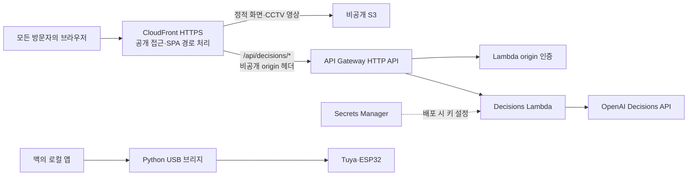

# ppippoppippo AWS 배포

프로젝트 루트는 이 폴더의 상위인 `../`입니다. 기존 Vite·React 앱과 OpenAI Decisions API를 AWS에 올리는 설정입니다. `prepare:aws`, `validate`, `preflight`, `preview`는 AWS 리소스를 생성하지 않습니다. **`deploy`만 실제 리소스를 만들고 파일을 업로드합니다.**

접속 주소: **https://dwif7iiddu9dy.cloudfront.net**

2026-10-09 배포 후 사용자 요청에 따라 화면·CCTV·AI 기능을 모두 공개했습니다. 방문자 로그인이나 IP 제한 없이 같은 주소로 접속합니다. S3 버킷과 API Gateway 원본은 계속 비공개 경로로 보호하며, 방문자는 CloudFront 주소를 이용합니다.

2026-10-09 최종 소스를 재배포했습니다. 앱·서버 73개 및 AWS 17개 테스트, 타입 검사, 프로덕션 빌드, 두 템플릿의 cfn-lint·프로젝트 cfn-guard·AWS `validate-template` 검사를 모두 통과했습니다. 이전에 실패했던 전체 인원 퇴장 테스트도 통과했습니다.

`SceneHtml` 초기화 수정과 최신 3D 모델을 포함했습니다. 실제 배포 주소에서 브라우저 캐시를 사용하지 않은 첫 로딩, 출입구 제어, 시뮬레이션 초기화, CCTV 두 영상의 로딩을 확인했고 브라우저 오류는 없었습니다. AI 상태 API도 정상 응답했습니다. 실제 OpenAI 판단·검토 호출은 최초 배포에서 검증했습니다.

배포된 HTML·주 JavaScript·신규 응급구조사 모델의 SHA-256이 준비한 파일과 일치함을 확인했습니다. 최신 검증 기록은 `.build/deployment.json`, `.build/release-check.json`, `.build/browser-check.json`에 있습니다.

## 소스 분석과 배포 범위

| 현재 소스 | AWS 배포 방식 | 이유 |
| --- | --- | --- |
| React·Three.js 화면, 시뮬레이션, Web Worker, WASM | 비공개 S3 + CloudFront HTTPS | Vite 빌드 결과가 브라우저에서 실행됩니다. |
| `server/decisions.ts`의 상태·판단·검토 API | API Gateway HTTP API + Node.js 22 Lambda | Vite 개발 서버 플러그인은 정적 파일 배포에 포함되지 않으므로 별도 실행 환경이 필요합니다. |
| `OPENAI_API_KEY` | Secrets Manager → Lambda 환경 변수 | 키 값은 프론트엔드·저장소·배포 명령 인수에 넣지 않습니다. |
| CCTV 녹화 영상 `public/media/cctv/` | S3 + CloudFront | 현재 화면에서 사용하는 MP4와 포스터를 포함합니다. 원본 `references/` 폴더는 제외합니다. |
| USB 화면·LED·스피커 | 맥에서 기존 앱과 Python 브리지 실행 | AWS 서버가 맥의 USB에 직접 접근할 수 없습니다. AWS 화면은 장치 미리보기로 동작합니다. |
| 시뮬레이션·분석 상태 | 각 브라우저 메모리 | 현재 서버 영구 저장 기능이 없어 DynamoDB는 생성하지 않습니다. 사용자 간 상태 공유·재접속 후 복구도 제공하지 않습니다. |

행사 운영 판단은 기존 `/v1/decisions`, `gpt-6-luna` 계약을 그대로 사용합니다. AWS 배포가 실제 CCTV 비전 추론 기능을 새로 추가하지는 않습니다.



모든 리전별 리소스는 `ap-southeast-2`에 생성합니다. CloudFront는 글로벌 서비스이며 Lambda@Edge는 사용하지 않습니다. CLI는 모든 요청에 `--profile ppippoppippo --region ap-southeast-2`를 명시합니다. 이 구성은 HTTP API의 기본 라우팅·Lambda 인증·요청 제한을 사용하며, REST API의 사용 계획이나 API 키 기능은 사용하지 않습니다.

## 준비와 검증

필요 도구는 Node.js 22, npm, AWS CLI v2, `uv`, `zip`, `tar`입니다. 아래 명령은 **프로젝트 루트**에서 실행합니다. 현재 `infra/`에 있다면 먼저 `cd ..`를 실행하세요.

```bash
# 의존성 설치: 최초 실행 또는 lock 파일 변경 시
npm ci
npm ci --prefix infra

# 타입 검사, 테스트, AWS용 화면 빌드, Lambda ZIP, 파일 해시 생성
npm --prefix infra run prepare:aws

# CloudFormation 스키마 + 프로젝트 cfn-guard 규칙 검사
npm --prefix infra run validate

# AWS 로그인·요금제·템플릿 형식을 읽기 전용으로 확인
npm --prefix infra run preflight

# 실제 배포 파일을 로컬에서 확인: http://127.0.0.1:4179
npm --prefix infra run preview
```

`validate`는 `cfn-lint 1.57.2`를 uv 캐시에서 실행합니다. `cfn-guard 3.2.1` 공식 바이너리는 SHA-256을 확인한 뒤 `infra/.build/tools/`에만 저장합니다. 전역 설정을 바꾸지 않습니다. 다른 실행 파일을 사용하려면 `CFN_GUARD_BIN`으로 경로를 지정하세요. 검사 결과는 `.build/validation/`에 저장합니다.

`preview`는 OpenAI 키를 읽지 않으며, 상태 API는 `configured: false`를 반환합니다. 화면·CCTV·WASM·장치 미리보기 확인용입니다.

루트 `npm test`는 기존 앱·서버 테스트를 실행하고, `npm --prefix infra test`는 AWS 어댑터·CloudFront 테스트를 실행합니다. 앱만 개발할 때 인프라 의존성을 설치할 필요가 없도록 분리했으며 `prepare:aws`는 두 테스트를 모두 실행합니다.

산출물은 `infra/.build/`에 모입니다.

| 파일 | 용도 |
| --- | --- |
| `site/` | AWS용 정적 화면. `VITE_DEVICE_MODE=preview`로 빌드합니다. |
| `lambda.zip` | `index.mjs` 한 파일로 묶은 API·origin 인증 코드 |
| `template.yaml`, `bootstrap.yaml`, `rules.guard` | 해당 배포본의 인프라 설정과 검사 규칙 |
| `manifest.json` | 생성 시각, Git 커밋·미커밋 변경 여부, 파일 크기·SHA-256 |

로컬 개발용 `dist/`를 덮어쓰지 않습니다. `.env`, 소스맵, `node_modules/`, `references/`, 펌웨어·학습 자료는 업로드 대상에 넣지 않습니다. 다만 **`public/`에 넣은 파일은 모두 사이트 배포 대상**이므로 CCTV 녹화본을 교체·제거했다면 다시 준비해야 합니다. 배포 스크립트는 검증된 `.build/` 파일만 사용하며, 준비 후 소스를 고쳤다면 `prepare:aws`를 다시 실행해야 반영됩니다.

## 배포 설정

### 1. 로컬 설정 파일

```bash
cp infra/config.example.json infra/config.local.json
```

프로필·리전·스택 이름과 OpenAI 비밀 ARN을 `config.local.json`에 저장합니다. 이 파일은 Git에서 제외합니다. 현재 배포 설정이 있으면 복사 명령으로 덮어쓰지 마세요. 공인 IP를 입력할 필요는 없습니다.

사용자가 전체 공개를 선택하여 IPv4·IPv6 방문자 모두 화면·정적 파일·CCTV·AI API에 접근할 수 있습니다. Google/Builder ID 로그인은 AWS 관리용이며 서비스 방문자는 로그인하지 않습니다. 공개 방문자의 AI 요청도 프로젝트에 연결한 OpenAI 키로 처리됩니다.

CloudFront가 추가하는 무작위 origin 헤더를 API Gateway의 Lambda 인증기에서도 확인합니다. 따라서 API Gateway 원본 주소의 직접 호출은 차단하고 공개된 CloudFront 경로로 요청을 받습니다. 이 방법은 [CloudFront 사용자 지정 origin 헤더](https://docs.aws.amazon.com/AmazonCloudFront/latest/DeveloperGuide/add-origin-custom-headers.html)와 [HTTP API Lambda 인증기](https://docs.aws.amazon.com/apigateway/latest/developerguide/http-api-lambda-authorizer.html)를 사용합니다.

### 2. AI를 켤 경우 OpenAI secret ARN

시드니 리전의 [Secrets Manager 콘솔](https://ap-southeast-2.console.aws.amazon.com/secretsmanager/listsecrets?region=ap-southeast-2)에서 일반 비밀을 만들고, 키 이름을 `OPENAI_API_KEY`, 값은 실제 OpenAI 키로 설정합니다. 저장 형식은 이 키를 포함한 JSON이어야 합니다.

생성한 **ARN만** `config.local.json`의 `openAISecretArn`에 입력합니다. 키 값 자체는 이 파일이나 터미널 명령에 넣지 않습니다. 비밀은 현재 AWS 프로젝트와 같은 프로젝트·리전에 있어야 하며, 이 기본 구성에서는 Secrets Manager 기본 암호화 키를 사용합니다. 사용자 지정 KMS 키를 사용하는 비밀은 별도 배포 권한 검토가 필요합니다.

ARN을 빈 문자열로 두면 화면은 배포할 수 있고 AI 판단은 비활성화됩니다. AWS 권한과 OpenAI 모델 사용 권한은 별개이며, 실제 키로 Decisions API를 호출하는 검증은 별도로 필요합니다.

비밀 값을 교체한 후에는 `secretRevision`을 `"2"`, `"3"`처럼 변경하고 다시 배포하세요. Lambda 환경 변수는 배포 시 해석되므로 Secrets Manager 값 변경만으로 갱신되지 않습니다. 자동 생성한 origin 인증 비밀은 독립적으로 수동 회전시키지 말고 CloudFront·인증기·API를 함께 갱신해야 합니다. [CloudFormation 비밀 참조 문서](https://docs.aws.amazon.com/AWSCloudFormation/latest/UserGuide/dynamic-references-secretsmanager.html)

## 배포 명령과 확인

아래 명령부터 실제 AWS 변경과 사용료가 발생할 수 있습니다.

```bash
npm --prefix infra run deploy
```

진행 순서는 산출물 해시 검사 → 로컬 인프라 검사 → AWS 읽기 전용 점검 → 비공개 아티팩트 버킷 생성 → Lambda ZIP 업로드 → 애플리케이션 스택 생성·수정 → 화면 업로드 → CloudFront 캐시 갱신입니다. 기본 스택은 `ppippoppippo-web-artifacts`, `ppippoppippo-web`입니다. 배포가 끝나면 `https://....cloudfront.net` 주소가 출력됩니다.

공개 주소에서 다음을 확인합니다.

1. 웹 화면, 3D 시뮬레이션, 분석 화면, CCTV 녹화 영상이 열립니다.
2. `/api/decisions/status`가 JSON을 반환하고 비밀 설정 여부와 일치합니다.
3. AI를 설정했다면 판단·검토를 각각 한 번 실행하여 실제 OpenAI 연결을 확인합니다.
4. 장치 탭은 웹 미리보기로 표시되며 `/api/device/publish`를 반복 호출하지 않습니다.
5. 다른 네트워크에서도 웹·영상·AI 상태가 열립니다. 인증 없는 API 원본 직접 접근만 401 또는 403으로 거절됩니다.

반복 확인용 명령도 제공합니다. 기본 검사는 OpenAI를 호출하지 않으며, `--live-ai`를 추가하면 판단·검토 API를 한 번씩 실제 호출합니다. 결과는 `infra/.build/deployment.json`에 기록합니다.

```bash
npm --prefix infra run smoke
npm --prefix infra run smoke -- --live-ai
```

로컬 검사만으로 실제 CloudFront 배포, 프로젝트 IAM 정책·서비스 할당량, OpenAI 호출 성공을 보증할 수 없으므로 재배포 후에도 위 검사를 실행하세요. CLI 로그인이 만료되면 다음 명령으로 갱신합니다.

```bash
aws login --profile ppippoppippo --region ap-southeast-2
```

## 운영과 복구

- 정적 해시 자산은 먼저 업로드하고 HTML을 마지막에 올립니다. 이전 탭에서 사용하는 파일을 위해 업로드 시 `--delete`를 사용하지 않습니다. 이름이 고정된 미디어는 `no-cache`, 해시 자산은 장기 캐시로 설정합니다.
- 원본 CCTV를 배포 후 제거할 때에는 소스에서 지우는 것 외에 S3의 해당 객체 삭제와 CloudFront 캐시 무효화가 필요합니다. 일반 재배포는 이전 객체를 자동 삭제하지 않습니다.
- 정상 배포한 `.build/`의 `site/`, `lambda.zip`, 두 템플릿, `rules.guard`, `manifest.json`을 별도로 보관하면 이전 파일 묶음을 복원하여 재배포할 수 있습니다. CloudFormation의 인프라 롤백은 별도로 업로드한 S3 화면을 자동 복원하지 않습니다.
- Lambda의 기존 2.5초 제한은 실행 환경 하나 안에서만 적용됩니다. API Gateway의 초당 2건·순간 5건 제한도 최선형 제한이며 비용 상한은 아닙니다. AI 결과는 캐시하지 않고 입력은 8 KiB, 업스트림 대기는 15초로 제한합니다.
- API 접근 로그와 Lambda 로그는 14일 보관합니다. 본문·키를 기록하지 않습니다. API 5xx 알람은 CloudWatch에서 확인할 수 있으며 이메일·메신저 발송은 설정하지 않았습니다.
- 현재 장기 CloudTrail 저장용 trail은 설정하지 않았습니다. 배포 관리 작업은 CloudFormation 이벤트와 CloudTrail 기본 이벤트 이력에서 확인하며, 기본 이력의 보존 기간은 90일입니다.
- 2026-10-09 점검에서 프로젝트는 `FREE / ACTIVE`였습니다. 사용 서비스는 [새 AWS 경험의 지원 서비스 목록](https://docs.aws.amazon.com/accounts/latest/reference/supported-services-sign-up-new.html)에서 확인했습니다. 무료 플랜에도 사용 한도는 있으며, OpenAI 사용료는 AWS 크레딧과 별개입니다. 현재 상태와 지출 제한은 AWS Settings → Billing에서 확인합니다.
- 스택을 삭제하더라도 S3 버킷·비밀·로그는 보존됩니다. 복구용 데이터의 손실을 막기 위한 설정이며, 사용을 끝낼 때는 이 남은 리소스를 별도로 정리해야 합니다.

로컬 USB 데모는 기존 명령을 계속 사용합니다.

```bash
npm run dev
npm run device:bridge
npm run device:beacon
```

장치의 기존 localhost 접근 제한은 유지했습니다. AWS 화면에서 실제 장치를 제어하려면 인증된 장치 통신·상태 동기화 기능을 별도로 구현해야 합니다.
